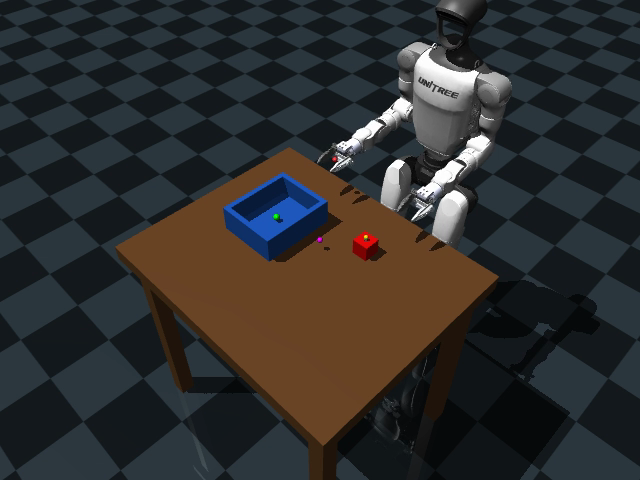
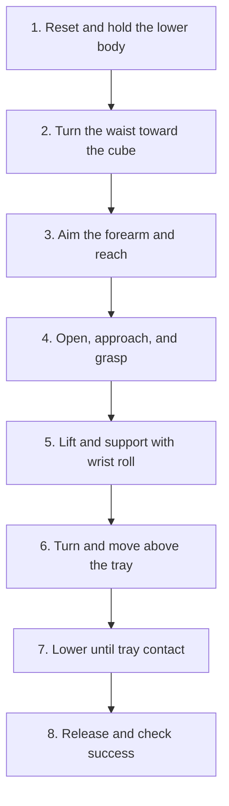

# Unitree G1 MuJoCo Pick-and-Place

## 1. Project Overview

This repository contains my entrance-test submission for the VLA Humanoid
Robot research project. I focused on Tasks 1 and 2:

1. Building a simulated manipulation task with a Unitree G1 humanoid robot.
2. Controlling the robot without a learned model and verifying that it can
   interact with the environment correctly.

The task instruction is:

> Pick up the red cube and place it in the tray.

The simulation uses the **Unitree G1 29-DoF model** with a **Dex1-1 two-finger
gripper**. I selected Dex1-1 so I could prioritize a complete and reproducible
pick-and-place pipeline within the available time.

The robot stays in one place during the task. Its legs do not walk or balance,
and the controller only moves the waist, right arm, wrist, and gripper. (This
setup is called a **fixed base**.) I used the MuJoCo Python API because Isaac
Lab is not supported on macOS.

Approximate development time: **18 hours**.

## 2. Simulation Environment

The environment contains:

- A fixed-base Unitree G1 29-DoF robot;
- A Dex1-1 two-finger gripper;
- A table that the robot and cube cannot pass through;
- A red cube that is not fixed to the table. MuJoCo decides how it moves and
  turns when the robot touches it;
- A tray with a bottom and four physical walls;
- Colored points that show the hand target, cube center, tray center, and task
  center;
- Two fixed cameras for observation and demonstration videos;
- A reset that returns everything to the same starting state, plus optional
  small cube-position changes that can be repeated with the same random seed.



The robot model is generated from the official Unitree assets:

- [Base-model builder](scripts/build_smoke_model.py)
- [Generated G1 model](models/base/g1_29dof_dex1_fixed.xml)

The table, cube, tray, and camera settings are stored in YAML files instead of
being written directly inside the controller:

- [Baseline scene configuration](configs/level1_scene.yaml)
- [Scene builder](scripts/build_level1_scene.py)
- [Baseline MJCF scene](models/task1/baseline.xml)
- [Workspace-rotation builder](scripts/rotate_workspace_variant.py)

The reset code is in:

- [Environment and reset helpers](scripts/level1_env.py)
- [Reset demonstration](scripts/level1_reset_demo.py)
- [Automated reset tests](tests/test_level1_reset.py)

## 3. Control Policy

The policy is a sequence of simple steps. It sends target positions to the
robot joints, moves smoothly between targets, calculates poses that bring the
hand to a chosen point, and checks when objects touch. (The technical methods
are position control, minimum-jerk interpolation, inverse kinematics, and
contact detection.) The cube is never moved directly by the code during the
task; it only moves through MuJoCo physics.

Main implementation files:

- [Complete pick-and-place controller](scripts/full_pick_to_tray_center.py)
- [Initial aiming and approach planner](scripts/sync_planar_scrubber.py)
- [Grasp-and-lift physics probe](scripts/grasp_lift_probe.py)



### 3.1 Reset and hold

**Joints used:** No commanded task motion. The lower-body joints remain at
their reset position targets.

The robot, motor targets, cube position, cube speed, and simulation time all
return to the beginning of the task.

*(Implementation: deterministic reset through
[`level1_env.py`](scripts/level1_env.py).)*

### 3.2 Turn toward the cube

**Joint used:** `waist_yaw_joint`.

The other task joints are initially held while the waist turns the upper body
toward the cube. The goal is to place the cube in front of the right arm before
the arm reaches forward.

*(Implementation: the target waist angle is calculated from the current robot
and cube positions. In the final replay, the following elbow-aiming motion
partly overlaps this turn to reduce waiting time.)*

### 3.3 Aim the forearm and reach

**Joints used:** `right_elbow_joint`, `waist_pitch_joint`,
`right_shoulder_pitch_joint`.

First, the elbow turns the forearm toward the cube. The waist then bends
forward and the shoulder moves the arm forward. The elbow keeps adjusting so
the hand continues moving toward the cube.

*(Implementation: the path is divided into several small target points. Inverse
kinematics calculates the shoulder and elbow values, and minimum-jerk
interpolation keeps the motion smooth.)*

### 3.4 Open, approach, and grasp

**Joints used:** `right_shoulder_pitch_joint`, `right_elbow_joint`,
`right_dex1_finger_joint_1`, `right_dex1_finger_joint_2`.

The gripper opens and moves to a raised position near the cube. It then moves
down to the grasp position and closes both fingers around the cube.

*(Implementation: MuJoCo contact detection checks whether both fingers touch
the cube and whether the gripper base hits it.)*

### 3.5 Lift and add wrist support

**Joints used:** `right_elbow_joint`, `right_wrist_roll_joint`.

The elbow lifts the cube away from the table. The wrist then rotates so one
finger supports the cube from underneath during transport.

*(Implementation: the lift and wrist turn use smooth joint-position targets,
while MuJoCo physics controls the cube motion.)*

### 3.6 Turn and move above the tray

**Joints used:** `waist_yaw_joint`, `waist_pitch_joint`,
`right_shoulder_pitch_joint`, `right_shoulder_roll_joint`,
`right_shoulder_yaw_joint`, `right_elbow_joint`, `right_wrist_roll_joint`,
`right_wrist_pitch_joint`, and `right_wrist_yaw_joint`.

The waist first turns toward the tray. The upper body and right arm then move
the cube above the tray center while the gripper remains closed.

*(Implementation: inverse kinematics calculates joint values that can place the
hand above the tray.)*

### 3.7 Lower into the tray

**Joints used:** `right_shoulder_pitch_joint`, `right_elbow_joint`,
`right_wrist_pitch_joint`, `right_wrist_roll_joint`.

The shoulder, elbow, and wrist lower the cube while keeping it above the tray
center. The wrist also turns back from its supporting angle. The robot slows
down when the cube gets close to the tray bottom.

*(Implementation: the controller uses position feedback and contact detection
while updating the joint targets.)*

### 3.8 Release and check success

**Joints used:** `right_dex1_finger_joint_1`,
`right_dex1_finger_joint_2`.

The fingers open only after the cube touches the tray or stops very close to
the tray bottom.

A run is successful when:

- Both fingers touch the cube during the lift;
- The cube remains held during transport;
- The cube center is inside the tray when viewed from above;
- The cube reaches the tray bottom;
- The cube still touches the tray after release;
- The cube is almost still at the end.

## 4. Baseline Demonstration

The baseline completed the full grasp, lift, transport, controlled descent,
and release sequence.

In the baseline run:

- Both fingers touched the cube during lift and transport;
- The gripper base did not hit the cube during grasp or transport;
- Final horizontal cube-to-tray center error of approximately **0.58 cm**;
- Release after a settled contact condition;
- Tray contact maintained after release.

- [Baseline metrics](results/metrics/baseline.json)
- [Camera 1 - front-left](results/videos/baseline_camera_1_front_left.mp4)
- [Camera 2 - rear-right](results/videos/baseline_camera_2_rear_right.mp4)

## 5. Setup Variants

I also ran the same task with several scene changes. Each result below comes
from one repeatable MuJoCo run.

### 5.1 Higher table

The table, cube, and tray are raised while the task logic stays the same. The
run succeeded with approximately **1.63 cm** final horizontal error.

- [Configuration](configs/variants/table_high.yaml)
- [Model](models/task1/table_high.xml)
- [Metrics](results/metrics/table_high.json)
- [Camera 1 - front-left](results/videos/table_high_camera_1_front_left.mp4)
- [Camera 2 - rear-right](results/videos/table_high_camera_2_rear_right.mp4)

### 5.2 Workspace rotated left

The table, cube, tray, markers, and cameras are rotated together around the
robot. This mainly tests the first waist turn without simply moving the table
farther away. The run succeeded with approximately **0.16 cm**
final horizontal error.

- [Configuration](configs/variants/workspace_left.yaml)
- [Model](models/task1/workspace_left.xml)
- [Metrics](results/metrics/workspace_left.json)
- [Camera 1 - front-left](results/videos/workspace_left_camera_1_front_left.mp4)
- [Camera 2 - rear-right](results/videos/workspace_left_camera_2_rear_right.mp4)

### 5.3 Workspace rotated right

The complete workspace is rotated in the opposite direction. The run
succeeded with approximately **0.29 cm** final horizontal error.

- [Configuration](configs/variants/workspace_right.yaml)
- [Model](models/task1/workspace_right.xml)
- [Metrics](results/metrics/workspace_right.json)
- [Camera 1 - front-left](results/videos/workspace_right_camera_1_front_left.mp4)
- [Camera 2 - rear-right](results/videos/workspace_right_camera_2_rear_right.mp4)

### 5.4 Cube on pedestal

The cube starts on a raised pedestal while the tray remains on the table. This
tests the approach from a different starting height. The run succeeded
with approximately **0.80 cm** final horizontal error.

- [Configuration](configs/variants/cube_on_pedestal.yaml)
- [Model](models/task1/cube_on_pedestal.xml)
- [Metrics](results/metrics/cube_on_pedestal.json)
- [Camera 1 - front-left](results/videos/cube_on_pedestal_camera_1_front_left.mp4)
- [Camera 2 - rear-right](results/videos/cube_on_pedestal_camera_2_rear_right.mp4)

### 5.5 Cube and tray mirrored

The cube and tray switch sides across the robot's forward centerline. The
pickup and transfer paths are calculated again for the new target.
The left elbow also adjusts during the torso motion so the left forearm stays
nearly horizontal and avoids the table and tray.

The run succeeded with approximately **1.31 cm** final horizontal error. The
left arm did not touch the table or tray, and the left forearm stayed within
approximately **2.56 degrees** of horizontal.

- [Swap controller](scripts/swap_left_forearm_level_demo.py)
- [Configuration](configs/variants/swap_cube_tray.yaml)
- [Model](models/task1/swap_cube_tray.xml)
- [Metrics](results/metrics/swap_cube_tray.json)
- [Camera 1 - front-left](results/videos/swap_cube_tray_camera_1_front_left.mp4)
- [Camera 2 - rear-right](results/videos/swap_cube_tray_camera_2_rear_right.mp4)

## 6. Reproduction

```bash
git clone --recurse-submodules \
  https://github.com/RayyyyyQi/unitree-g1-mujoco-pick-place.git

cd unitree-g1-mujoco-pick-place
python3.10 -m venv .venv
source .venv/bin/activate
python -m pip install -r requirements-lock.txt
```

Run the smoke test:

```bash
python scripts/smoke_test.py
```

Run the reset tests:

```bash
python -m pytest -q tests/test_level1_reset.py
```

Run the baseline controller:

```bash
python scripts/full_pick_to_tray_center.py \
  --model models/task1/baseline.xml \
  --transport-wrist-roll-deg 90 \
  --place-descent \
  --coordinated-place
```

On macOS, interactive playback should use the environment's `mjpython`
launcher with the same arguments and `--viewer`.

## 7. Challenges and Design Decisions

- Isaac Lab was unavailable on macOS, so the task was implemented in MuJoCo.
- I kept the robot in one place so I could focus the available time on the arm
  and gripper instead of walking and balance. (Fixed-base setup.)
- The cube slid when the gripper stayed at its original angle, so I turned the
  wrist and placed one finger underneath the cube. (Wrist-roll support.)
- Releasing at one fixed height sometimes dropped the cube too far, so the
  final policy waits until the cube touches the tray or settles very close to
  it. (Contact-aware release.)
- In the mirrored setup, the left arm initially interfered with the workspace.
  The final controller moves the left elbow while the waist bends so the
  forearm stays almost horizontal and clear of the table. (Synchronized elbow
  compensation.)

## 8. AI Tool Usage

AI tools were used to assist with implementation, debugging, documentation,
and experiment organization.

I reviewed the resulting design and can explain how the environment is built,
how each joint moves, how the hand target is calculated, how the gripper holds
the cube, how success is checked, and how the results were measured.
